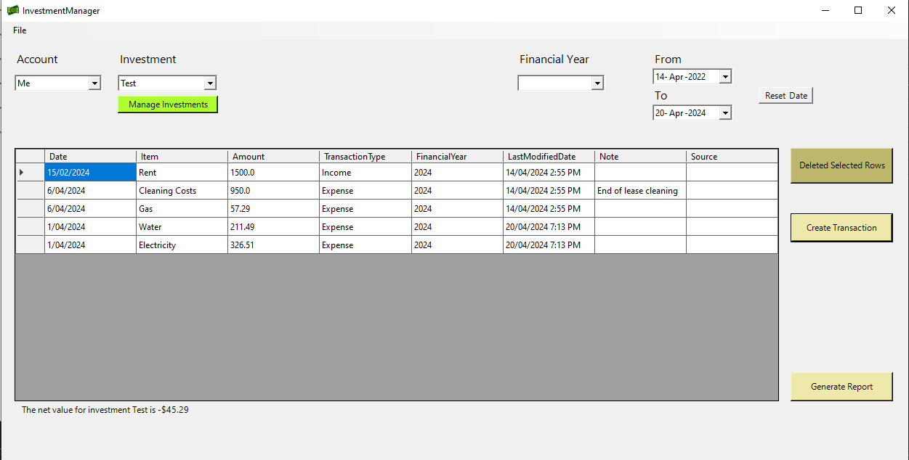
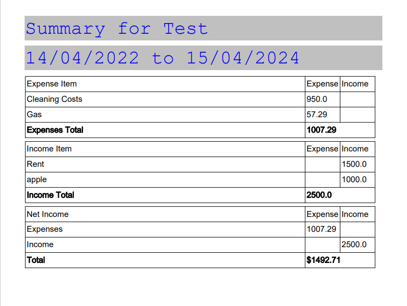

Winform application to track income and expenses for Investments.

This application can be used to view transactions by financial year to help with tax returns.

Uses a sqlite db stored in the %APPDATA%/Deductions directory.

The standalone bin is stored as Deductions.zip

## The app
The app features a single homepage which is used to display a list of transactions given a investment.
Multiple investments can be managed at once. 
There are options to select transactions from a specific financial year.
Transactions can be entered manually or by importing from a csv file (see below)

## Importing from csv

The csv MUST be in the following format(example file provided as template.csv):

Date, TransactionType, Amount, Category, Note (optional)

## Generating a report

A pdf report can be generated to summarise the currently selected FY and investment.
An example of the generated pdf can be seen below:  

## Credits
app logo derived from 
<a href="https://www.flaticon.com/free-icons/cash" title="cash icons">Cash icons created by Smashicons - Flaticon</a>